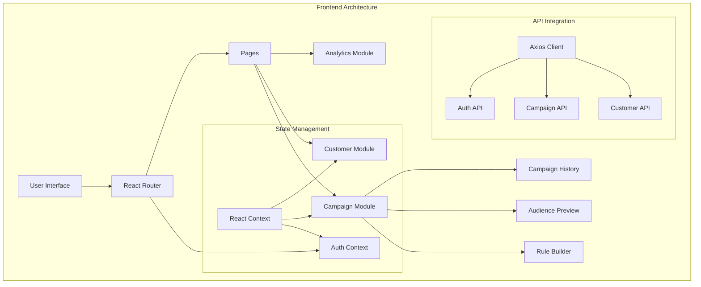

# Mini CRM Frontend 🎨

A modern, React-based frontend for the Mini CRM platform that enables customer segmentation, campaign management, and intelligent insights using AI.

## 🏗️ Architecture



## ✨ Features

### 1. Campaign Management
- Dynamic rule builder for audience segmentation
  - Drag-and-drop interface
  - AND/OR condition support
  - Natural language input support
- Real-time audience size preview
- Campaign history with detailed analytics
- AI-powered message suggestions
- Campaign performance tracking

### 2. Authentication & Security
- Google OAuth 2.0 integration
- Protected routes with role-based access
- Secure token management
- Session persistence
- Automatic token refresh

### 3. User Interface
- Modern, responsive design
- Interactive data visualizations
- Real-time updates
- Error handling & notifications

## 🛠️ Tech Stack

- **Framework**: React.js 18+ with Vite
- **Styling**: Tailwind CSS + HeadlessUI
- **State Management**: React Context + Custom Hooks
- **HTTP Client**: Axios
- **UI Components**: 
  - Heroicons for icons
  - React-Query for data fetching
  - React-Hook-Form for forms
  - React-DnD for drag-and-drop

## 🚀 Detailed Setup Instructions

### Prerequisites

1. Node.js Setup
   ```bash
   # Check Node.js version (should be 18+)
   node --version
   
   # If needed, install or update Node.js from https://nodejs.org/
   ```

2. Package Manager
   ```bash
   # Install or update npm
   npm install -g npm@latest
   
   # Verify installation
   npm --version
   ```

### Installation Steps

1. Clone the repository and navigate to frontend:
   ```bash
   cd frontend
   ```

2. Install dependencies:
   ```bash
   npm install
   ```

3. Environment Configuration:
   Create a `.env` file in the frontend directory:
   ```env
   # API Configuration
   VITE_API_URL=http://localhost:3000
   ```

4. Start Development Server:
   ```bash
   # Development mode with hot reload
   npm run dev
   
   # Production build
   npm run build
   npm run preview
   ```

5. Access the Application:
   - Development: http://localhost:5173
   - Preview (production build): http://localhost:4173


## 📱 Application Structure

```
frontend/
├── src/
│   ├── components/        # Reusable UI components
│   ├── pages/            # Page components
│   ├── contexts/         # React contexts
│   ├── hooks/           # Custom hooks
│   ├── services/        # API services
│   ├── utils/           # Utility functions
│   ├── styles/          # Global styles
│   └── App.jsx          # Root component
├── public/              # Static assets
└── vite.config.js       # Vite configuration
```


## 🚨 Troubleshooting

Common issues and solutions:

1. **CORS Issues**
   - Verify API URL in .env
   - Check browser console for errors
   - Ensure backend CORS configuration

2. **Authentication Problems**
   - Clear browser cookies
   - Check Google OAuth configuration
   - Verify token expiration

3. **Build Failures**
   - Clear node_modules and reinstall
   - Update Node.js version
   - Check for conflicting dependencies

## 📚 Additional Resources

- [React Documentation](https://react.dev)
- [Vite Guide](https://vitejs.dev/guide/)
- [Tailwind CSS](https://tailwindcss.com/docs)
- [Google OAuth Setup](https://console.cloud.google.com)

## 📱 Available Pages

### 1. Login Page (`/login`)
- Google OAuth login button
- Redirect to dashboard after authentication

### 2. Campaigns Page (`/campaigns`)
- List of all campaigns with status
- Create new campaign button
- Campaign performance metrics
- Real-time delivery stats

### 3. Campaign Creation
- Dynamic rule builder interface
- Natural language input for rules
- Audience size preview
- Message template input

## 🔌 API Integration

The frontend communicates with the backend through these endpoints:

```javascript
// Campaign endpoints
GET    /api/campaigns
POST   /api/campaigns
POST   /api/campaigns/:id/start
GET    /api/campaigns/:id/stats

// Auth endpoints
GET    /auth/google
POST   /auth/logout
```

